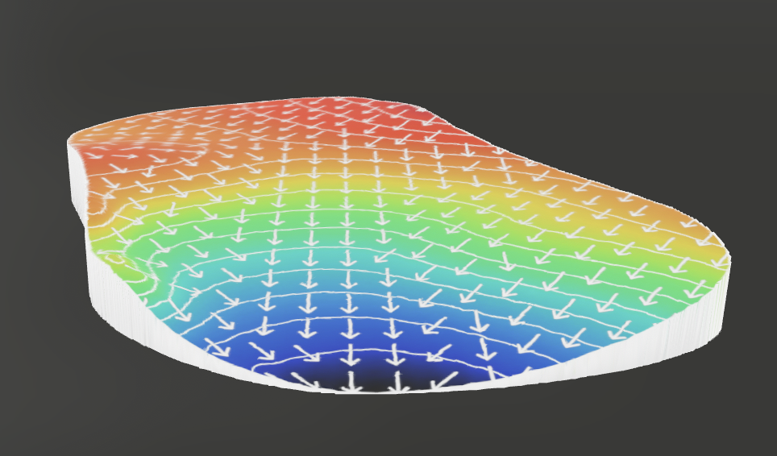
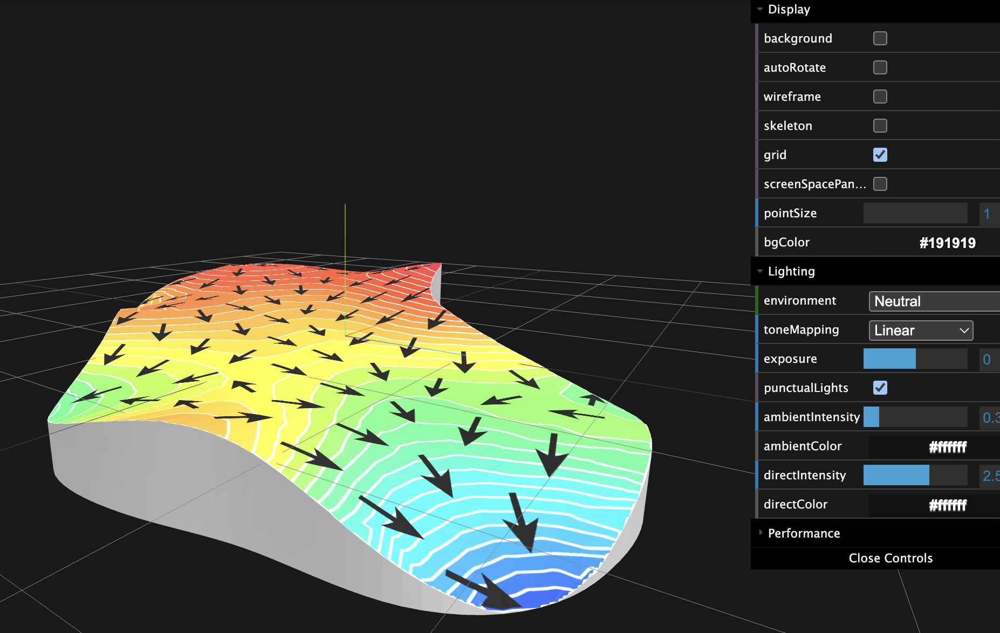

## Project Overview

This project is a tool to visualize the 3d coordinates of a golf green and convert them to a 2d map and a 3d model. the 2d map and 3d model will be
a contour map with color gradient, contour lines, and gradient arrows.

the input are json files, each file contains the 3d coordinates of a golf green. example can be found
in [testcases/input](./testcases/input/)

### Green 2d
the output are png files, each file is a 2d map of a golf green, for example:


### Green 3d
the output are 3d models, and we need both glb and usdz format.

there is an example of 3d model in [model-examples](./model-examples), in which [1.json](./model-examples/1.json) is the metadata of the model




## Key requirements

- the 2d map and 3d model should be accurately represent the 3d coordinates of the golf green
- the edge should be smooth
- the gradient arrows should be evenly distributed, not overlapped with each other, not crossing the edge, and the density should be adjustable

## Set up Python Environment

```bash
python -m venv venv
source venv/bin/activate
pip install -r requirements.txt
```

## Test

### Step 1. Generate Green 2d png files

the script will load coordinates from testcases/input and generate png files in testcases/output/green_2d
```bash
python src/plot_green_2d.py 
```

### Step 2. Generate Green 3d models in glb format

the script will load coordinates from testcases/input and png files generated in above step, and generate 3d models in testcases/output/green_3d

```bash
python src/plot_green_3d.py 
```

### Step 3. Visualize/Validate the *.glb files

- open https://gltf-viewer.donmccurdy.com/
- drag the *.glb file into the page(for example [2.glb](./model-examples/2.glb))
- drag to rotate the 3d model




### Step 4. Generate Green 3d models in usdz format