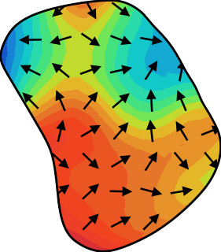
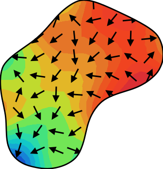

## Project Overview

This project is a tool to visualize the 3d coordinates of a golf green and convert them to a 2d map. the 2d map will be a contour map with color gradient, contour lines, and gradient arrows.

the input are json files, each file contains the 3d coordinates of a golf green. example can be found in `testcases/json`

the output are png files, each file is a 2d map of a golf green, for example:





this project is initially built from ./prompt.md

## Set up Python Environment

```bash
python -m venv venv
source venv/bin/activate
pip install -r requirements.txt
python src/main.py
```

## Batch Processing(todo)

will use airflow + mongodb + aws infrastructure to process the data.
