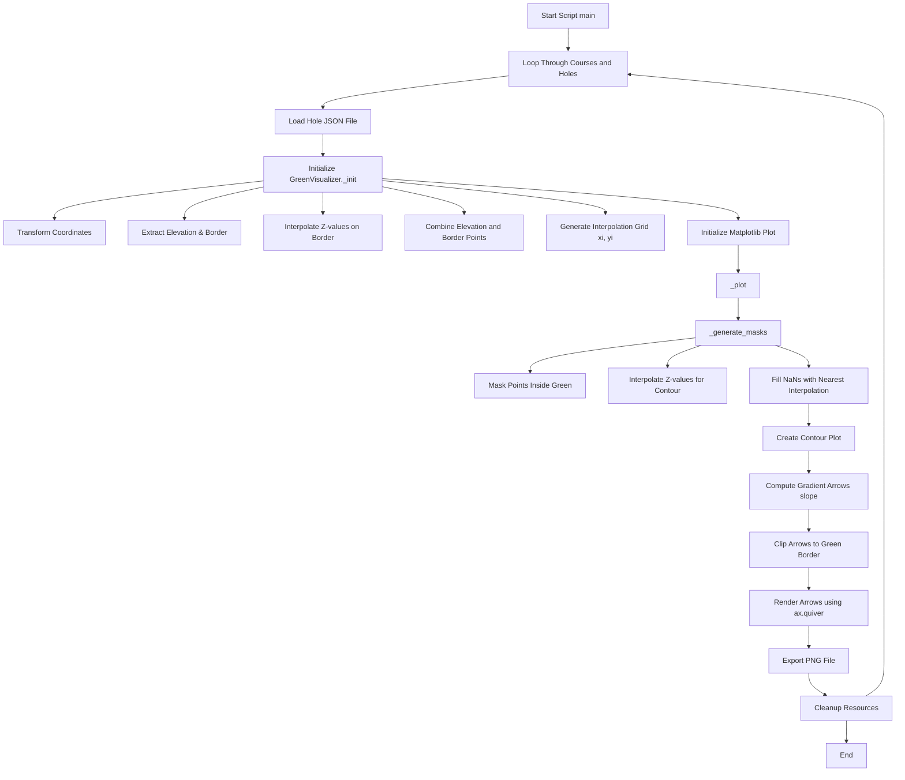

# 📘 Green 2D Visualizer Script — Technical Explanation

This document explains the workflow and implementation details of the `plot_green_2d.py` script, which is responsible for generating 2D contour visualizations of golf greens from 3D elevation data.

---

## 🧭 Purpose

The script converts 3D golf green data (in JSON format) into 2D contour maps that include:

- Elevation-based color gradients
- Contour lines
- Gradient arrows representing slope direction

These maps can be used for visualization, analysis, and as part of a larger system that also includes 3D model generation.

---

## 🛠 Inputs and Outputs

- **Input**: JSON files (one per hole), each containing:
  - `GreenBorder`: the boundary of the green
  - `Elevation`: a list of 3D elevation points

- **Output**: PNG images saved to `testcases/output/green_2d/`, one for each hole

---

## 🧩 Core Class: `GreenVisualizer`

This class manages the full data processing pipeline:

### Key Methods

| Method | Purpose |
|--------|---------|
| `plot_holes()` | Main loop through all hole files and calls the visualization methods |
| `_init()` | Loads and preprocesses geometry and elevation data |
| `_generate_masks()` | Interpolates elevation and masks out regions outside the green |
| `_plot()` | Generates the final contour plot with arrows |
| `_plot_edge()` | (Optional) Plots raw edges for debugging |
| `cleanup()` | Frees up matplotlib resources between plots |

#### _init():
- Loads elevation and boundary data.
- Transforms coordinates.
- Calls `_smooth_and_densify_edge()`: Smooths and densifies the green boundary.
- Interpolates elevation data for the boundary and grid points.
- Sets up the plotting figure and axes (`plt.subplots`).

#### _plot(self):
- Generates a contour map (`_generate_masks()`) with a color gradient (dx dy calculation from `_eps_gradient(zi_masked)`).
- Calls `get_arrow_width_and_length_scale()`: get pre-defined arrow width and length scale.
- Adds arrows to represent the slope direction and magnitude (`ax.quiver`).
- Saves the final visualization as a PNG file (`plt.savefig`).

---

## 🗺️ Workflow Diagram (Mermaid)

### Explanation of Key Nodes

| Node    | Description                                                               |
|---------| ------------------------------------------------------------------------- |
| `A`     | Entry point in the `__main__` block                                       |
| `C`     | Loads `.json` files per hole, containing green geometry & elevation       |
| `D1-D6` | `_init()` prepares the data, sets up coordinate systems, and creates grid |
| `E1`    | `_generate_masks()` interpolates Z-values and applies boundary masks      |
| `E2`    | Contour is rendered with color gradients                                  |
| `E3`    | Computes vector field (gradient) for slope arrows                         |
| `E4`    | Clips arrows so they don't exceed the green border                        |
| `F`     | Final PNG file is saved to disk                                           |
| `G`     | Cleans matplotlib resources and memory                                    |
| `H`     | Script completes after all holes are processed                            |

## 📌 Features Implemented
- ✅ Accurate color gradient mapping
- ✅ Contour lines using cubic and linear interpolation
- ✅ Smoothed green boundary via spline
- ✅ Gradient arrows with clipping and normalization
- ✅ DPI-scaled high-resolution export
- ✅ Logging and error handling
- ✅ Batch processing of multiple courses and holes