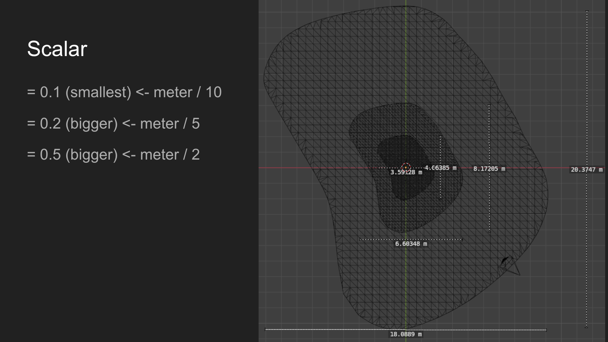

# 3D Modelling Docs

## Adjustable Parameters

- `SCALER` (default: 0.1): A scaling factor for the mesh surface, used to adjust the size of the model, the larger the value, the larger the model.
  - Suggested values:
    - 0.1: 1 meters divide by 10 (smaller model)
    - 0.15: 1 meters divide by 6.67
    - 0.2: 1 meters divide by 5
    - 0.3: 1 meters divide by 3.33 (bigger model)
    - 
- `PEAK_THRESHOLD` (default 0.04): A threshold value to determine if a point is a peak in the elevation data. If the difference between a point and its neighbors is greater than this value, it is considered a peak.
  - Suggested values:
    - 0.02: more sensitive to peaks
    - 0.04: default value
    - 0.06: less sensitive to peaks
- `PEAK_ADJUST_LOOP_COUNT` (default=2), increase this value to adjust more peaks in the elevation data.
  - Do one full pass over the grid and adjust obvious peak points. 
  - Then do a second pass, which may catch remaining peaks that weren’t adjusted in the first pass (e.g., multi-layer peaks).
- `elevation_in_border_ratio`(default 0.8), ratio threshold to consider within the green border
  - if the ratio of elevation points is within the green border > `elevation_in_border_ratio` * total elevation points, then we consider it as a valid elevation point.
  - else, we will replace the green border with the convex hull of the elevation points.
## `get_model_data`
- Returns 5 parameters
  - vertices (`total_points`): list of vertices of the mesh surface
  - indices (`total_indices`): list of indices for the vertices of the mesh surface
  - texture coordinate (`total_texcoords`): list of texture coordinates for the mesh surface
  - wall vertices (`side_points`): list of vertices for the walls of the mesh
  - wall indices (`side_indices`): list of indices for the wall vertices

### Process

0. Data Loading
   - Load the model data from a json file (`Elevation, Green Border, Green Center, Green Front, Green Back`)
   - `xarr = [], yarr = [], zarr = []`: original datapoint (lat, lon)
   - `cxarr, cyarr`: converted datapoint (meters)

1. Data Preprocessing
   - Find `xmin, xmax, ymin, ymax, zmin, zmax, cxmin, cxmax, cymin, cymax` from the original data
   - `xvalues, yvalues`: unique values of x and y coordinates (using `set()`), for creating grid
   - `xdup, ydup`: duplicate values that appear x times
   - Create a 2D board with -1 for each cell (defined by `len(xdup) * len(ydup)`)
     - Filtering: If the point is outside the green border, we will skip this point
     - Localized peak detection & replace
       - For each point in the grid, we will check if it is a peak (i.e., has a higher elevation than its neighbors)
       - If it is a peak, we will replace the elevation with the mean elevation of its neighbors
     - Output 1: board, index of the vertices in the mesh surface [0, .... len(total elevation points within green border)]
     - Output 2: total_points, [x, y, z]
     - Output 3: total_texcoords for the uv mapping (range [0, 1])

2. Performing structured grid triangulation
- Output: 
  - total_indices: list of indices for the vertices of the mesh surface, since this is triangulation, each quad is split into two triangles
```
Top view of quad:
(i,j) ------- (i,j+1)
  |            |
  |            |
(i+1,j) ---- (i+1,j+1)

Triangle 1:  (i,j) → (i+1,j) → (i,j+1)  
Triangle 2:  (i,j+1) → (i+1,j) → (i+1,j+1)

```

3. Vertical Edge Formation & Horizontal Edge Formation
- Output:
  - total_edges: list of two element list e.g. [[0, 1], [1, 2], ...] representing the edges of the mesh surface
- Vertical Edge Formation:
  - For each column, find the vertical edges by connecting the vertices in the same column.
```math
         j     j+1
       ┌───┬────┐
  i-1  │ A │ B  │  ← top row
       ├───┼────┤
   i   │ C │ D  │  ← current row
       ├───┼────┤
  i+1  │ E │ F  │  ← bottom row
       └───┴────┘

Top group (a):    A = board[i-1][j]
                  B = board[i-1][j+1]
                  C = board[i][j]
                  D = board[i][j+1]

Bottom group (b): C = board[i][j]
                  D = board[i][j+1]
                  E = board[i+1][j]
                  F = board[i+1][j+1]
```

- Horizontal Edge Formation:
  - For each row, find the horizontal edges by connecting the vertices in the same row.
```math
         j-1   j    j+1
       ┌───┬───┬────┐
   i   │ A │ B │ C  │ ← top row
       ├───┼───┼────┤
 i+1   │ D │ E │ F  │ ← bottom row
       └───┴───┴────┘

Left group (a):   A = board[i][j-1]
                  B = board[i][j]
                  D = board[i+1][j-1]
                  E = board[i+1][j]

Right group (b):  B = board[i][j]
                  C = board[i][j+1]
                  E = board[i+1][j]
                  F = board[i+1][j+1]
```

4. Get connected edges as a closed path
    After identifying vertical and horizontal edges along the green's boundary, we must trace these disconnected edge segments into a connected, ordered loop.
    
    This is achieved using a simple edge-walking algorithm:
    
    1. Start at the first edge's second point.
    
    2. Iteratively find the next edge that shares the current point but doesn’t backtrack to the previous point.
    
    3. Continue walking through the edge list, appending each new point.
    
    4. Stop once we return to the starting point, forming a closed path.
    
    This produces a clean, ordered list of boundary coordinates (`edge_points`) that defines the outer edge of the green. It’s essential for generating extruded walls and capping the 3D mesh in the .glb output.

   5. Build the extruded walls
      - Extrude the walls of the green area by creating vertical walls from the edge points.
      - The wall vertices are created by taking each edge point and adding a height value to create a vertical wall.
      - The wall indices are created by connecting the wall vertices in pairs to form rectangular faces.
      1. Iterating over GreenBorder polygon coordinates (outer border of the green)
      2. For each edge segment between consecutive points:
         1. We get the nearest point(s) on the grid (`edge_points`)
         2. Use `guess_elevation(...)` to interpolate the elevation for new vertices 
      3. Append:
         - Vertices (`total_points`)
         - Texture coords (`total_texcoords`)
         - Triangle/quad faces (`total_indices`)
         - Side faces (`side_points`, `side_indices`)
      
         We are using the following 3 helper functions:
        
        | Component           | Purpose                                                       | Role in the Loop                      |
        | ------------------- | ------------------------------------------------------------- |---------------------------------------|
        | `guess_elevation()` | Estimates elevation at arbitrary `(x, y)`                     | Converts polygon border to 3D surface |
        | `check()`           | Checks if a triangle (quad) can be formed around a grid point | Provides 3D context for projection    |
        | `check_valid()`     | Verifies neighbors in the grid are in-bounds and usable       | Ensures only safe planes are created  |


6. Check Winding Order and Flip the indices
   - checks the winding order of each triangle in a 3D mesh and ensures that all triangles have a consistent counter-clockwise (CCW) orientation in screen/view space.
   - It corrects triangles that are defined in a clockwise (CW) order by swapping the second and third vertex indices.

## `plot_holes`
- enerates a .glb file (GLTF 2.0 binary) representing a 3D model of a golf course green using elevation mesh data and a 2D texture overlay.

1. **Prepare Output Path**  
   Creates the directory structure for exporting the GLB file:
```
testcases/output/green_3d/course{course_index}/{hole_index}.glb
```
2. **Load Texture Image**  
Loads the corresponding 2D texture:
```
testcases/output/green_2d/course{course_index}/{hole_index}.png
```

3. **Extract Mesh Data**  
Fetches geometry from JSON:
```
testcases/input/course{course_index}/{hole_index}.json
```
- `vertices`, `indices`, `texcoords` → top surface  
- `vertices2`, `indices2` → vertical side walls

4. **Build GLB Buffer**  
Converts all geometry and texture data into a single binary blob.

5. **Create BufferViews & Accessors**  
Describes how each data chunk is stored and accessed.

6. **Add Texture and Materials**  
- Embeds the image as a texture
- Uses two materials:
  - `material` with image texture
  - `material2` with gray color + metallic/roughness effects

7. **Build Mesh and Scene Graph**  
- Constructs the mesh with two primitives (top + side)

8. **Export GLB**  
Saves the finalized 3D model as a `.glb` file.

---

## 📁 Input Files

- **JSON Mesh Data:**  
`testcases/input/course{course_index}/{hole_index}.json`

- **PNG Texture:**  
`testcases/output/green_2d/course{course_index}/{hole_index}.png`

---

## 📤 Output

- **GLB 3D Model:**  
`testcases/output/green_3d/course{course_index}/{hole_index}.glb`

This GLB includes:
- A textured top surface
- Vertical side walls
- Embedded PNG texture
- Transform node and scene structure

---
